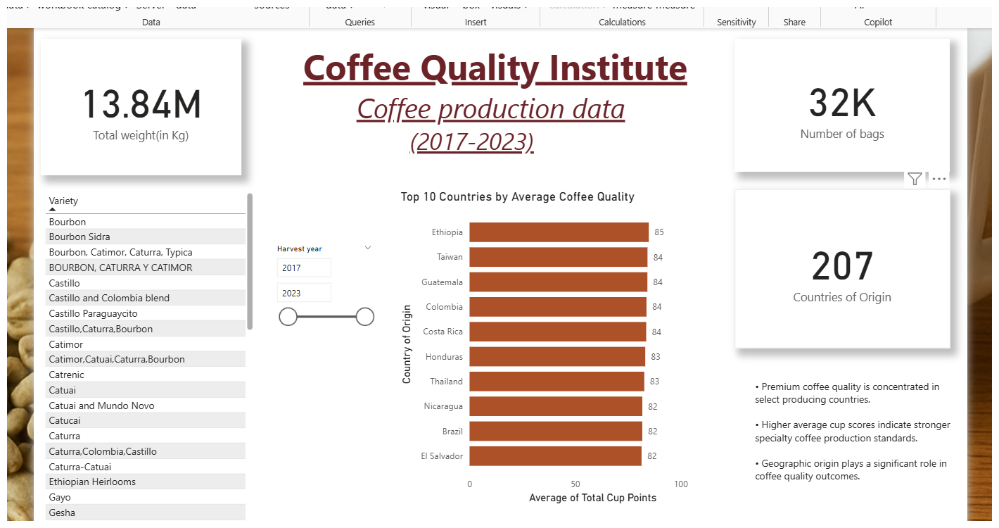
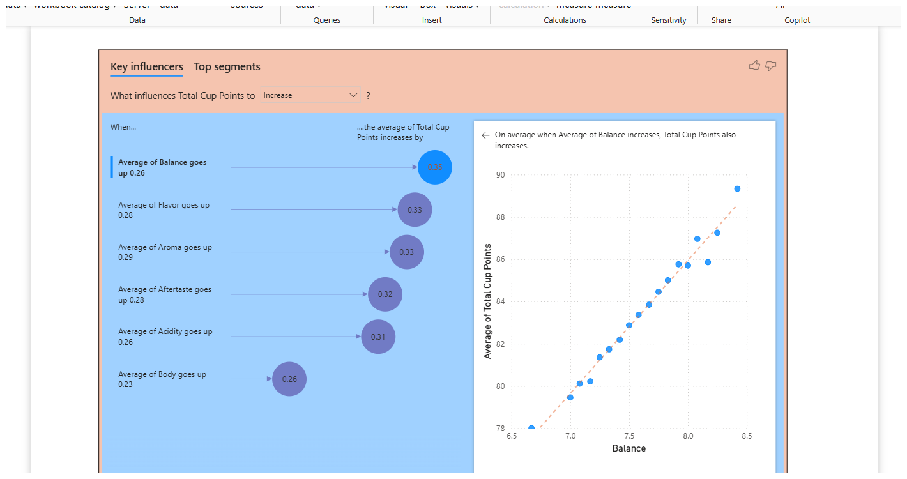
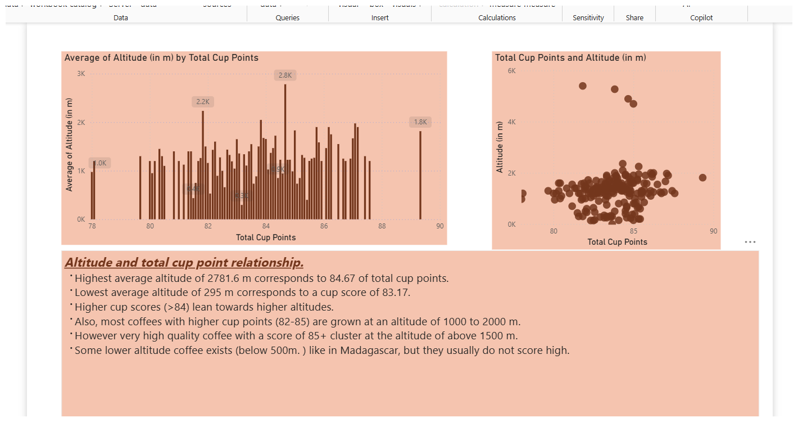
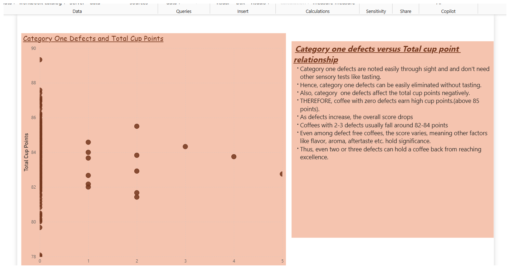
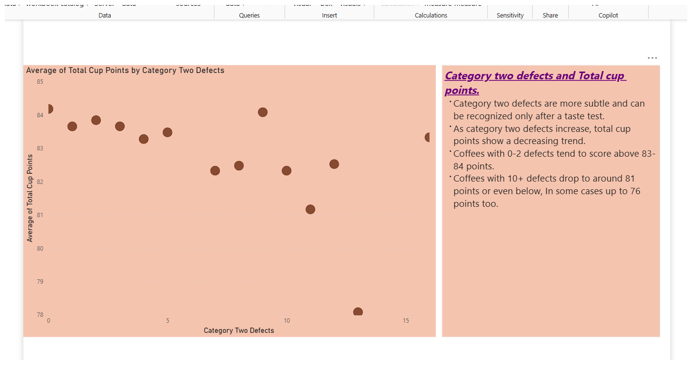
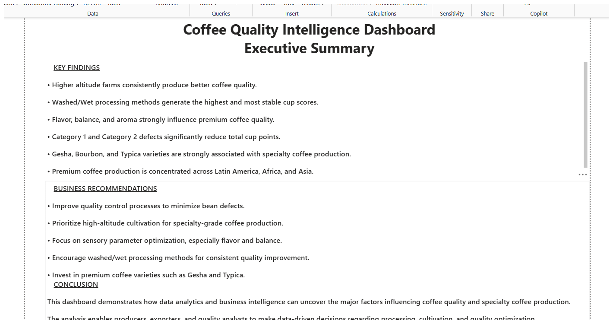

# Coffee Quality Analysis Dashboard

## Project Overview
This Power BI dashboard analyzes global coffee production and coffee quality trends using Coffee Quality Institute data (2017–2023).

The project focuses on identifying the major factors influencing premium coffee quality, including:
- Altitude
- Processing methods
- Coffee varieties
- Defects
- Sensory parameters

---

## Business Problem
Coffee producers and exporters need to understand which factors most strongly influence coffee quality and specialty-grade production.

This dashboard helps uncover:
- What drives higher cup scores
- How defects impact coffee quality
- Which countries and varieties produce premium coffee
- The relationship between altitude and coffee quality

---

## Tools Used
- Power BI
- Power Query
- DAX
- Data Cleaning
- Data Visualization

---

## Dashboard Screenshots

### Overview Dashboard

### Key Influencers Analysis

### Altitude vs Cup Points

### Category One Defects Analysis

### Category Two Defects Analysis

### Executive Summary

---

## Key Insights
- Higher altitude farms generally produce better coffee quality.
- Washed/Wet processing methods generate stable premium cup scores.
- Flavor, aroma, and balance strongly influence Total Cup Points.
- Category 1 and Category 2 defects negatively affect coffee quality.
- Premium coffee production is concentrated across Latin America, Africa, and Asia.

---

## Author
Hunney24
